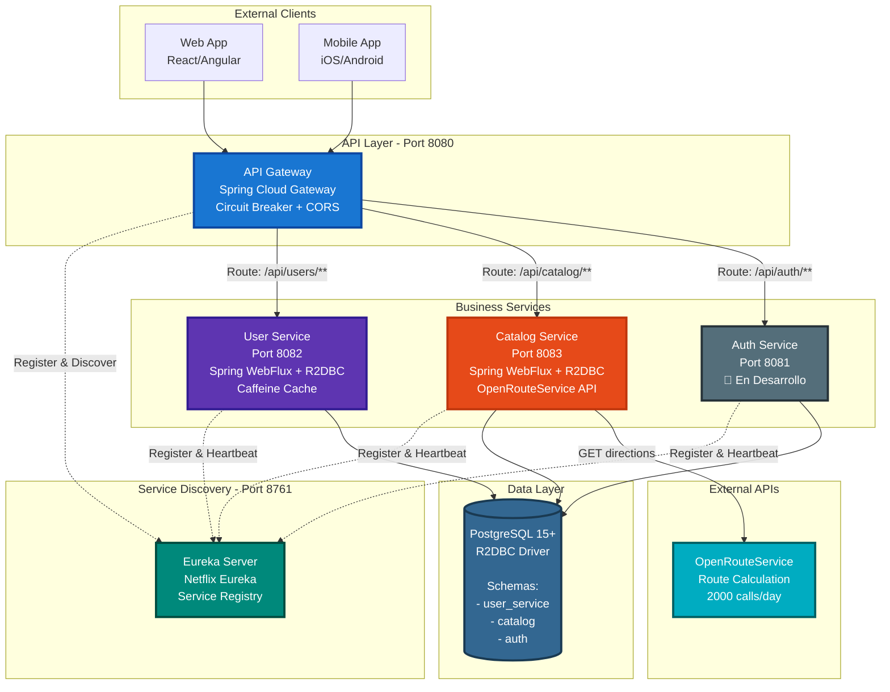
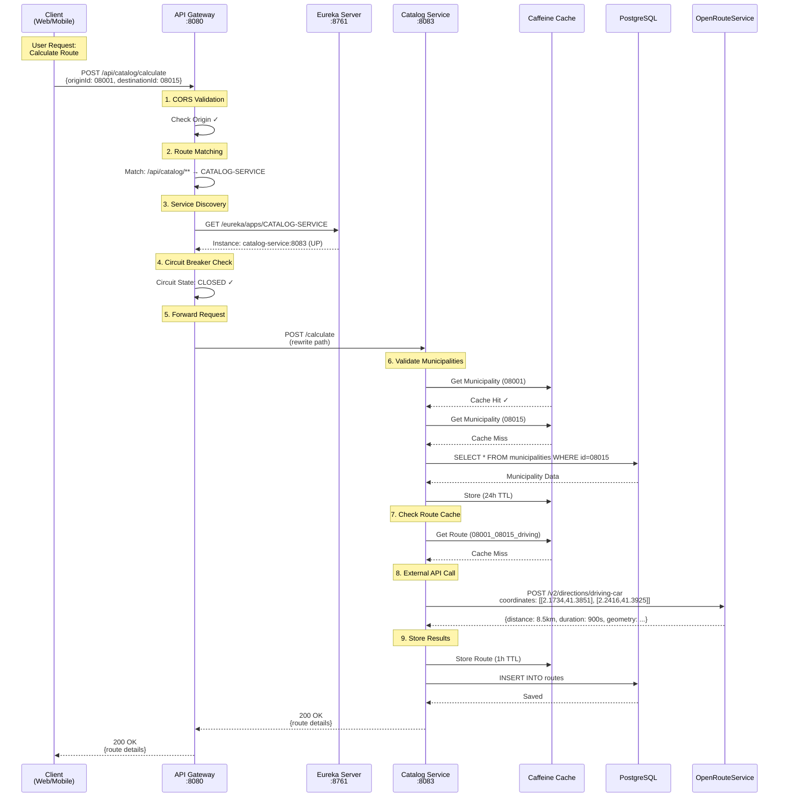
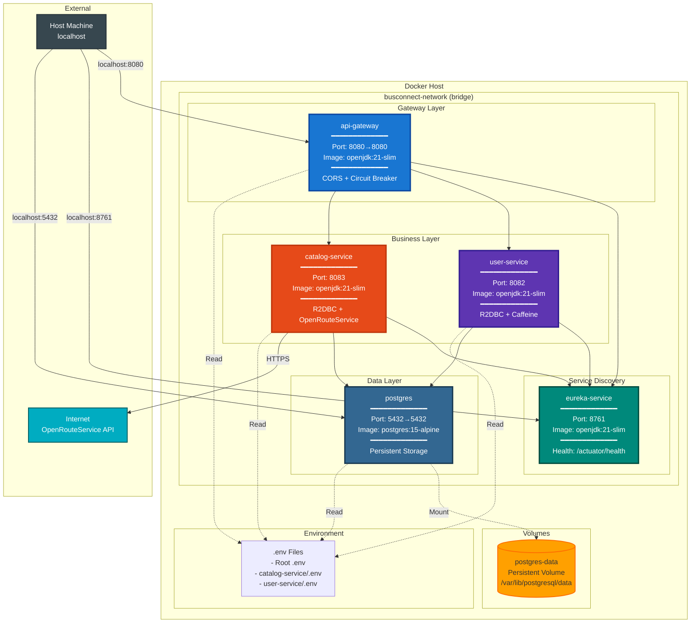
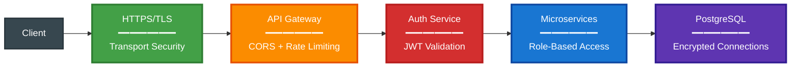

# BusConnect Backend - Arquitectura del Sistema

## 🏗️ System Architecture Overview



### Technology Stack

| Layer | Technology | Purpose |
|-------|------------|---------|
| **API Gateway** | Spring Cloud Gateway | Routing, Circuit Breaker, CORS |
| **Service Discovery** | Netflix Eureka | Service Registry & Load Balancing |
| **Microservices** | Spring Boot 3.3.13 + WebFlux | Reactive Non-blocking I/O |
| **Database Access** | Spring Data R2DBC | Reactive PostgreSQL Driver |
| **Database** | PostgreSQL 15+ | Persistent Storage |
| **Caching** | Caffeine | In-Memory Cache (L1) |
| **Resilience** | Resilience4j | Circuit Breaker + Timeout |
| **Containerization** | Docker + Docker Compose | Multi-container Orchestration |

---

## 🔄 End-to-End Request Flow

Flujo completo desde el cliente hasta la respuesta final:



### Performance Metrics

| Scenario | Cache | Database | External API | Total Time | Status |
|----------|-------|----------|--------------|------------|--------|
| **Best Case** | ✅ Hit (route) | - | - | ~5-10ms | 🟢 Excellent |
| **Partial Hit** | ✅ Hit (municipalities) | - | ⚠️ ORS call | ~500-800ms | 🟡 Good |
| **Cache Miss** | ❌ Miss all | 2 queries | ⚠️ ORS call | ~1500-2000ms | 🟠 Acceptable |
| **Error Case** | - | - | ❌ ORS timeout | Circuit opens | 🔴 Degraded |

---

## 🐳 Deployment Architecture

Infraestructura Docker con redes y volúmenes:



### Container Startup Order

```
━━━━━━━━━━━━━━━━━━━━━━━━━━━━━━━━━━━━━━━━━━━━━━━━
Stage 1: Data Layer
━━━━━━━━━━━━━━━━━━━━━━━━━━━━━━━━━━━━━━━━━━━━━━━━
1. postgres          
   ├─ Wait for healthy: pg_isready
   └─ Ready: Database accepting connections
   
━━━━━━━━━━━━━━━━━━━━━━━━━━━━━━━━━━━━━━━━━━━━━━━━
Stage 2: Service Discovery
━━━━━━━━━━━━━━━━━━━━━━━━━━━━━━━━━━━━━━━━━━━━━━━━
2. eureka-service    
   ├─ Depends on: postgres
   ├─ Wait for: http://eureka-service:8761/actuator/health
   └─ Ready: Registry accepting registrations
   
━━━━━━━━━━━━━━━━━━━━━━━━━━━━━━━━━━━━━━━━━━━━━━━━
Stage 3: Business Services (Parallel)
━━━━━━━━━━━━━━━━━━━━━━━━━━━━━━━━━━━━━━━━━━━━━━━━
3a. user-service     
    ├─ Depends on: postgres + eureka-service
    └─ Auto-register with Eureka
    
3b. catalog-service  
    ├─ Depends on: postgres + eureka-service
    └─ Auto-register with Eureka
   
━━━━━━━━━━━━━━━━━━━━━━━━━━━━━━━━━━━━━━━━━━━━━━━━
Stage 4: API Gateway
━━━━━━━━━━━━━━━━━━━━━━━━━━━━━━━━━━━━━━━━━━━━━━━━
4. api-gateway       
   ├─ Depends on: eureka-service
   ├─ Fetch service registry
   └─ Ready: Accepting client requests
```

### Network Configuration

```yaml
busconnect-network:
  driver: bridge
  ipam:
    config:
      - subnet: 172.20.0.0/16

Service IPs (auto-assigned):
- eureka-service:    172.20.0.2
- postgres:          172.20.0.3
- user-service:      172.20.0.4
- catalog-service:   172.20.0.5
- api-gateway:       172.20.0.6
```

### Port Mapping

| Service | Internal Port | External Port | Exposed to Host | Status |
|---------|--------------|---------------|-----------------|--------|
| **api-gateway** | 8080 | 8080 | ✅ Yes | 🟢 Public |
| **user-service** | 8082 | - | ❌ No (via Gateway) | 🔒 Internal |
| **catalog-service** | 8083 | - | ❌ No (via Gateway) | 🔒 Internal |
| **eureka-service** | 8761 | 8761 | ✅ Yes (Dashboard) | 🟡 Monitoring |
| **postgres** | 5432 | 5432 | ✅ Yes (Dev only) | ⚠️ Dev Only |

---

## 📦 Project Structure

```
busConnect-backend/
├── api-gateway/              # Spring Cloud Gateway (8080)
│   ├── ARCHITECTURE.md       # Gateway architecture details
│   ├── README.md
│   └── src/
├── catalog-service/          # Route calculation service (8083)
│   ├── ARCHITECTURE.md       # Catalog architecture details
│   ├── README.md
│   └── src/
├── eureka-service/           # Service discovery (8761)
│   ├── ARCHITECTURE.md       # Eureka architecture details
│   ├── README.md
│   └── src/
├── user-service/             # User management (8082)
│   ├── ARCHITECTURE.md       # User service architecture details
│   ├── README.md
│   └── src/
├── docker-compose.yml        # Multi-container orchestration
├── .env                      # Root environment variables
├── ARCHITECTURE.md           # 👈 This file (System overview)
└── README.md                 # Main documentation
```

---

## 🔍 Service Communication Patterns

### Synchronous Communication (HTTP/REST)

```
Client → API Gateway → Microservice
- Protocol: HTTP/1.1 over TCP
- Format: JSON
- Style: Request-Response
- Timeout: 10 seconds
- Retry: Circuit Breaker handles
```

### Service Discovery Pattern

```
Service Registration:
┌──────────────┐     register    ┌──────────────┐
│ Microservice │ ──────────────→ │ Eureka Server│
└──────────────┘                  └──────────────┘
       │                                 ▲
       │ heartbeat (every 30s)          │
       └─────────────────────────────────┘

Service Discovery:
┌─────────────┐   query      ┌──────────────┐
│ API Gateway │ ────────────→│ Eureka Server│
└─────────────┘              └──────────────┘
       │                            │
       │      service instances      │
       │◄────────────────────────────┘
       │
       ├──→ user-service:8082
       ├──→ catalog-service:8083
       └──→ ...
```

### Database Per Service Pattern

```
┌─────────────────┐     ┌──────────────────┐
│  user-service   │     │ catalog-service  │
└────────┬────────┘     └────────┬─────────┘
         │                       │
         │  user_service schema  │  catalog schema
         │                       │
         └───────────┬───────────┘
                     │
              ┌──────▼──────┐
              │  PostgreSQL │
              │   Database  │
              └─────────────┘

Isolation:
- Each service owns its schema
- No direct database access between services
- Service-to-service communication via REST APIs
```

---

## 🚀 Quick Start

```bash
# 1. Clone repository
git clone https://github.com/BusConnectTeam/busConnect-backend.git
cd busConnect-backend

# 2. Configure environment
cp .env.example .env
# Edit .env with your credentials

# 3. Start all services
docker-compose up -d

# 4. Verify services
curl http://localhost:8761           # Eureka Dashboard
curl http://localhost:8080/actuator/health  # Gateway Health
```

### Health Check URLs

```bash
# Eureka Server
http://localhost:8761

# API Gateway
http://localhost:8080/actuator/health

# User Service (via Gateway)
http://localhost:8080/api/users/actuator/health

# Catalog Service (via Gateway)
http://localhost:8080/api/catalog/actuator/health
```

---

## 🔗 Service Documentation

| Service | README | Architecture | Port |
|---------|--------|--------------|------|
| **API Gateway** | [README](./api-gateway/README.md) | [ARCHITECTURE](./api-gateway/ARCHITECTURE.md) | 8080 |
| **User Service** | [README](./user-service/README.md) | [ARCHITECTURE](./user-service/ARCHITECTURE.md) | 8082 |
| **Catalog Service** | [README](./catalog-service/README.md) | [ARCHITECTURE](./catalog-service/ARCHITECTURE.md) | 8083 |
| **Eureka Service** | [README](./eureka-service/README.md) | [ARCHITECTURE](./eureka-service/ARCHITECTURE.md) | 8761 |

---

## 📊 System Characteristics

### Scalability

```
Horizontal Scaling (Add instances):
┌──────────────┐
│ API Gateway  │ ───┐
└──────────────┘    │
                    ├──→ user-service-1:8082
┌──────────────┐    ├──→ user-service-2:8082
│   Eureka     │ ───┤
└──────────────┘    ├──→ catalog-service-1:8083
                    └──→ catalog-service-2:8083

Load Balancing: Round Robin (Ribbon)
```

### Resilience

| Pattern | Implementation | Purpose |
|---------|---------------|---------|
| **Circuit Breaker** | Resilience4j | Prevent cascading failures |
| **Timeout** | 10 seconds | Fail fast |
| **Fallback** | Graceful degradation | Return default response |
| **Retry** | Circuit breaker handles | Automatic retry logic |
| **Health Checks** | Spring Actuator | Monitor service status |

### Performance

| Metric | Target | Current |
|--------|--------|---------|
| Gateway Response Time (p95) | < 100ms | ~50ms (cached) |
| Service Response Time (p95) | < 500ms | ~200ms (cached) |
| Database Query Time (p95) | < 50ms | ~10-30ms |
| External API Call | < 2s | ~500-1500ms |
| Cache Hit Rate | > 80% | ~85-90% |

---

## 🔐 Security Considerations



**Security Status:**

| Feature | Status | Description |
|---------|--------|-------------|
| ✅ **CORS** | Implemented | Configured in API Gateway |
| ✅ **Environment Variables** | Implemented | Secrets in .env files |
| ✅ **DB Credentials** | Secured | Not in source code |
| ✅ **Network Isolation** | Implemented | Docker networks |
| 🚧 **JWT Authentication** | In Development | Auth service pending |
| 🚧 **HTTPS/TLS** | Pending | Production requirement |
| 🚧 **Rate Limiting** | Pending | DDoS protection |

---

## 🔗 Referencias

- [Main README](./README.md) - Setup y configuración general
- [Docker Setup](./DOCKER.md) - Instrucciones Docker detalladas
- [API Gateway Architecture](./api-gateway/ARCHITECTURE.md) - Detalles del gateway
- [Catalog Service Architecture](./catalog-service/ARCHITECTURE.md) - Sistema de rutas
- [User Service Architecture](./user-service/ARCHITECTURE.md) - Gestión de usuarios
- [Eureka Service Architecture](./eureka-service/ARCHITECTURE.md) - Service discovery
