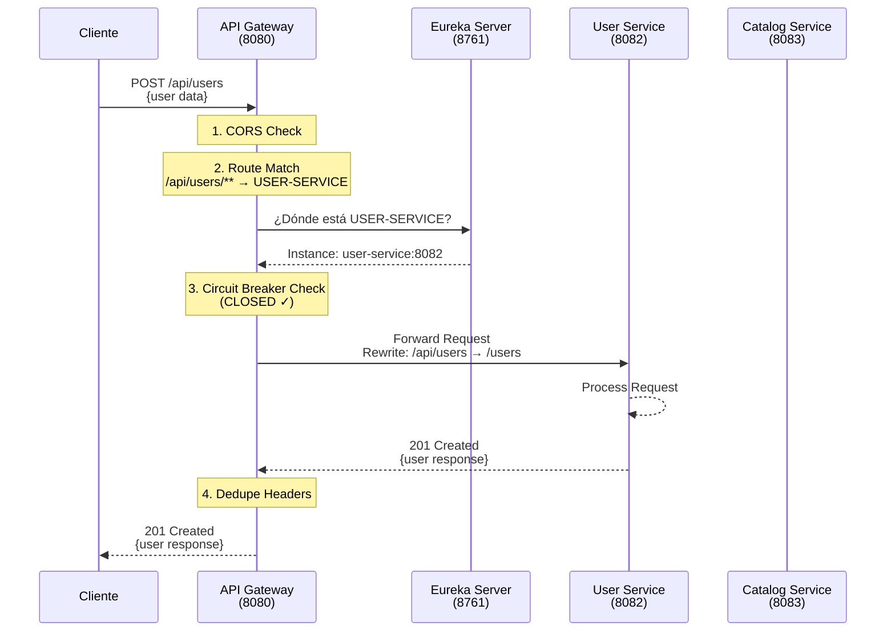
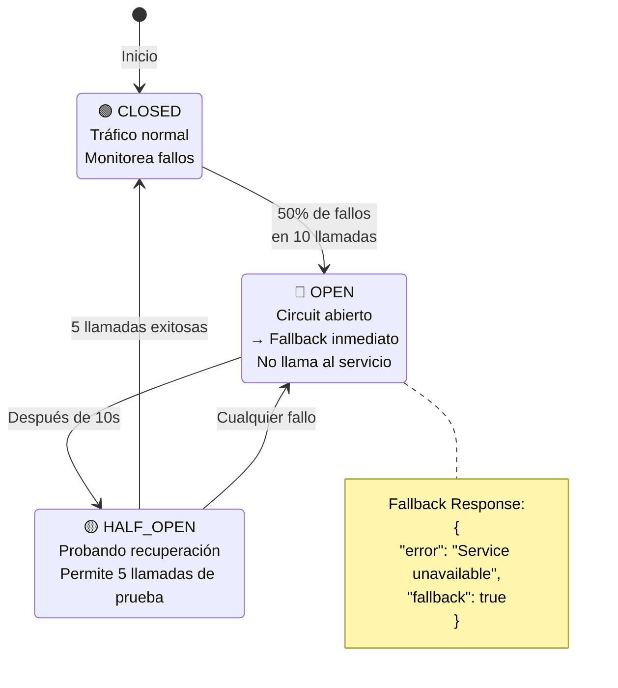
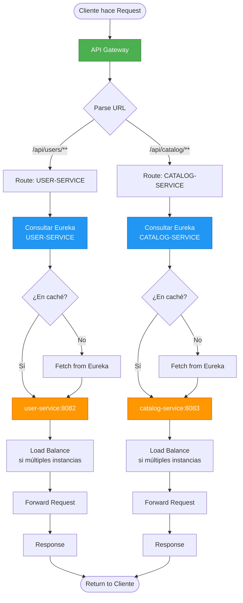
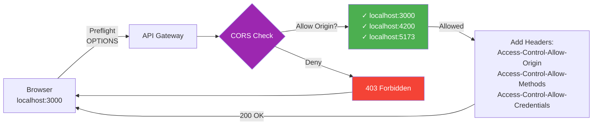
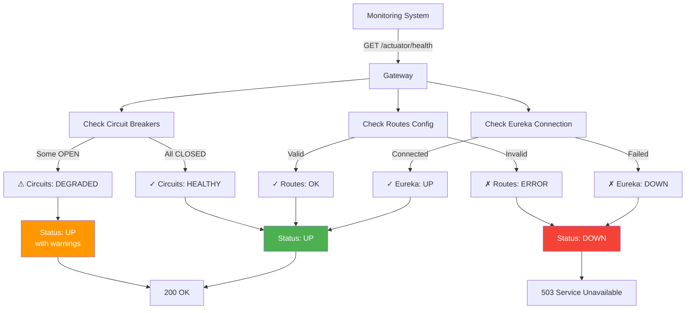

# API Gateway - Arquitectura

## 🔄 Flujo de Request

Cómo viaja una petición desde el cliente hasta los microservicios:



---

## ⚡ Circuit Breaker States

Estados del Circuit Breaker con Resilience4j:



### Configuración

| Parámetro | Valor | Descripción |
|-----------|-------|-------------|
| Sliding Window | 10 llamadas | Ventana de medición |
| Failure Rate Threshold | 50% | Umbral de fallos |
| Wait Duration | 10s | Tiempo en OPEN |
| Half-Open Calls | 5 | Llamadas de prueba |
| Timeout | 10s | Timeout por llamada |

---

## 🔍 Service Discovery Flow

Integración con Eureka Server:



### Load Balancing

Cuando hay múltiples instancias del mismo servicio:

```
USER-SERVICE:
├── instance-1: user-service:8082 (10.0.0.1)
├── instance-2: user-service:8082 (10.0.0.2)
└── instance-3: user-service:8082 (10.0.0.3)

Gateway selecciona usando Round Robin
```

---

## 🚦 Route Configuration

### Path Rewriting

```
Cliente → Gateway       Gateway → Service
─────────────────       ─────────────────
/api/users/123    →     /123
/api/catalog/routes →   /routes
```

### Filters Chain

```mermaid
graph LR
    Request[Request] --> F1[DedupeResponseHeader]
    F1 --> F2[RewritePath]
    F2 --> F3[CircuitBreaker]
    F3 --> Service[Target Service]
    
    Service --> R3[CircuitBreaker]
    R3 --> R2[RewritePath]
    R2 --> R1[DedupeResponseHeader]
    R1 --> Response[Response]
    
    style F3 fill:#f44336,color:#fff
    style R3 fill:#f44336,color:#fff
```



---

## 🔐 CORS Configuration



**Allowed Origins:**
- `http://localhost:3000` (React)
- `http://localhost:4200` (Angular)
- `http://localhost:5173` (Vite)

**Allowed Methods:**
- GET, POST, PUT, DELETE, PATCH, OPTIONS

**Credentials:** Enabled

---

## 📊 Health Check Flow



---

## 🎯 Resumen de Componentes

| Componente | Función | Tecnología |
|------------|---------|------------|
| **Routing** | Enrutamiento dinámico | Spring Cloud Gateway |
| **Service Discovery** | Descubrimiento de servicios | Netflix Eureka Client |
| **Circuit Breaker** | Tolerancia a fallos | Resilience4j |
| **Load Balancing** | Balanceo de carga | Ribbon (incluido en Eureka) |
| **CORS** | Gestión de CORS | Spring Cloud Gateway |
| **Timeouts** | Control de tiempos | Resilience4j TimeLimiter |

---

## 🔗 Referencias

- [README Principal](./README.md)
- [Configuración](./src/main/resources/application.yml)
- [Fallback Controller](./src/main/java/com/busconnect/apigateway/controller/FallbackController.java)
