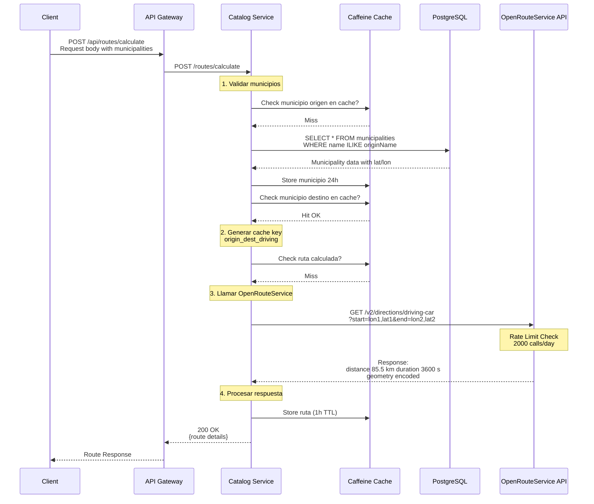
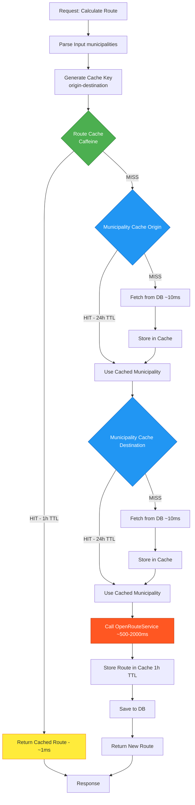
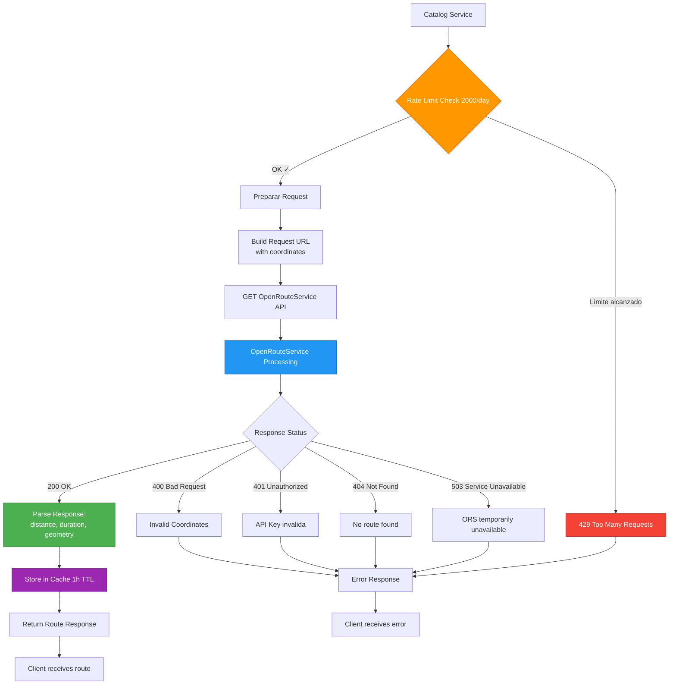
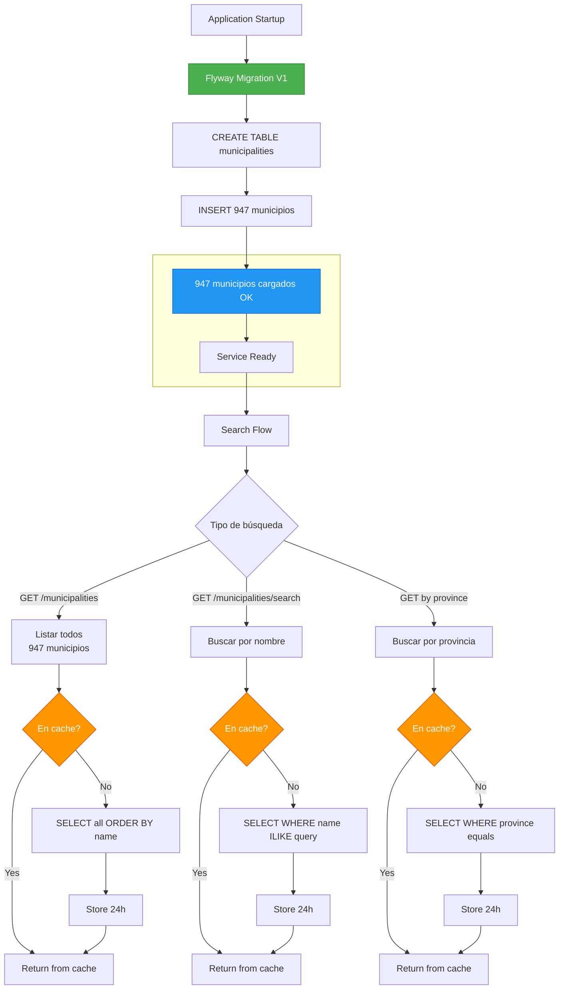
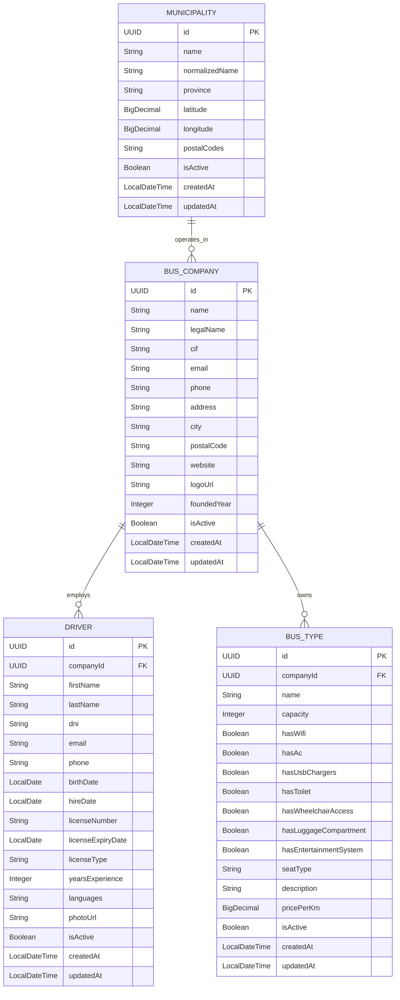
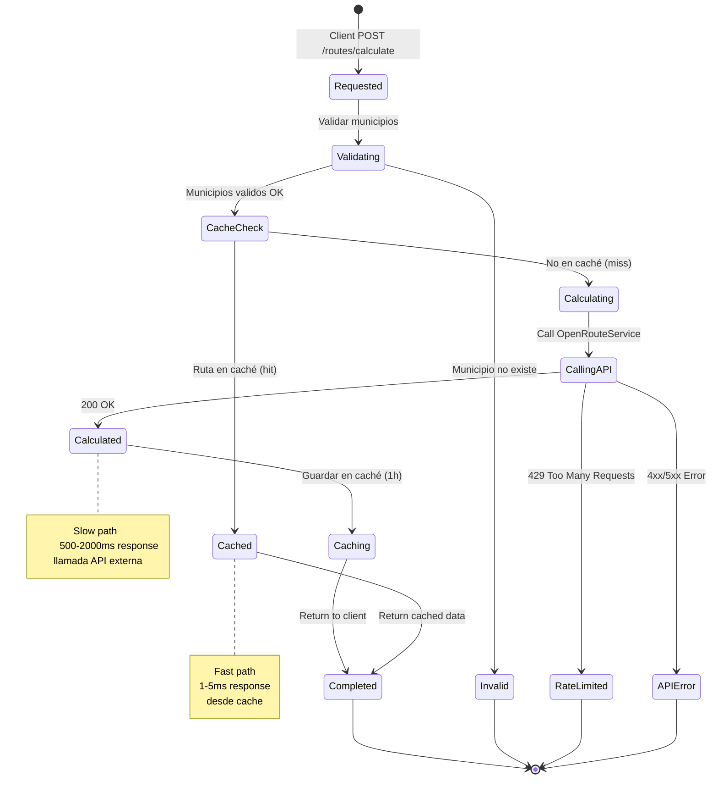
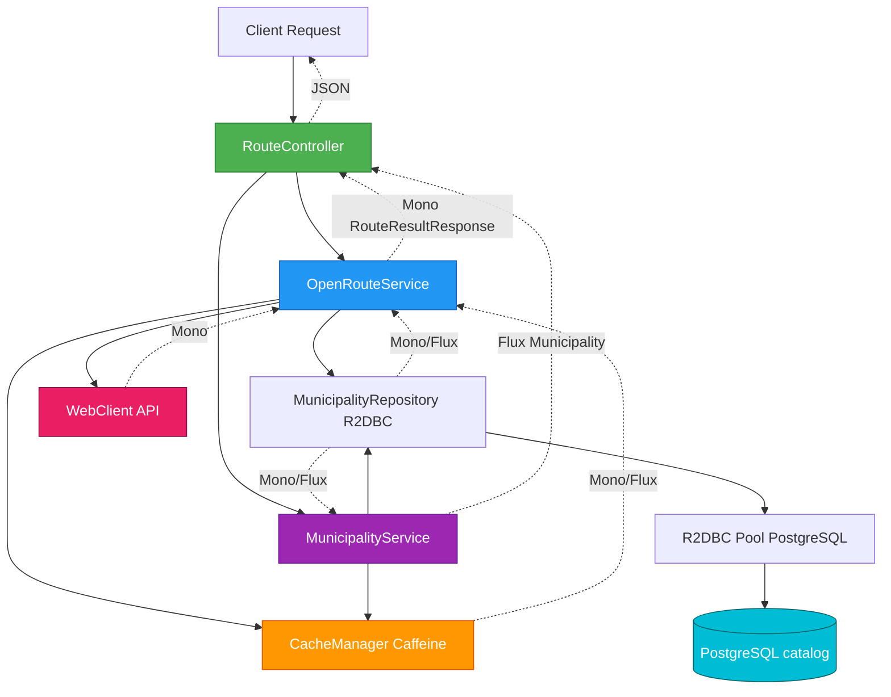
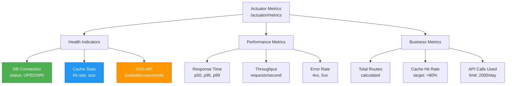

# Catalog Service - Arquitectura

## 🚌 Flujo de Cálculo de Rutas

Proceso completo desde la petición hasta la respuesta con ruta optimizada:



---

## 🗄️ Sistema de Caché Multinivel

Estrategia de caché con Caffeine para optimizar rendimiento:



### Configuración de Caché

| Caché | Max Entries | TTL | Hit Rate Esperado | Tiempo Respuesta |
|-------|-------------|-----|-------------------|------------------|
| **Routes** | 1000 | 1 hora | ~70-80% | ~1ms (cached) |
| **Municipalities** | 1000 | 24 horas | ~95%+ | ~1ms (cached) |
| **DB Query** | - | - | - | ~10-50ms |
| **OpenRouteService** | - | - | - | ~500-2000ms |

**Nota**: Las rutas calculadas NO se persisten en base de datos. Son efímeras y solo viven en caché durante 1 hora. Esto evita almacenamiento innecesario ya que las rutas pueden recalcularse bajo demanda.

### Estrategia de Keys

```
Route Cache Key Format:
{origin}-{destination}

Ejemplos:
"barcelona-badalona"    → Barcelona a Badalona
"barcelona-girona"      → Barcelona a Girona
"manresa-vic"           → Manresa a Vic

Nota: Los nombres se normalizan a minúsculas y se eliminan espacios
```

---

## 🌐 Integración con OpenRouteService

Flujo de comunicación con la API externa:



### Rate Limiting

```
Daily Limit: 2000 calls
Reset: Cada día a las 00:00 UTC

Estrategia:
┌─────────────────────────────────┐
│ Cache Hit (1h) → No consume API │
│ Cache Miss → Consume 1 call     │
└─────────────────────────────────┘

Con 70% hit rate:
- 10,000 requests/day
- 3,000 API calls needed
- ❌ Excede límite

Con caché necesitamos:
- Hit rate > 80% para <2000 calls/day
```

---

## 🗺️ Gestión de Municipios

Arquitectura de datos para 947 municipios de Catalunya:



### Estructura de Datos

```
Municipality Entity:
├── id: UUID (Primary Key)
├── name: String (e.g., "Barcelona")
├── normalizedName: String (e.g., "barcelona")
├── province: String (e.g., "Barcelona", "Girona", "Lleida", "Tarragona")
├── latitude: BigDecimal (41.3874)
├── longitude: BigDecimal (2.1686)
├── postalCodes: String (e.g., "08001, 08002")
├── isActive: Boolean (default: true)
├── createdAt: LocalDateTime
└── updatedAt: LocalDateTime

Indices:
├── PRIMARY KEY (id)
├── INDEX idx_name (name)
├── INDEX idx_normalized (normalized_name)
├── INDEX idx_province (province)
├── INDEX idx_active (is_active)
└── INDEX idx_coordinates (latitude, longitude)

Total registros: 947 municipios
- Barcelona: 311 municipios
- Girona: 221 municipios  
- Lleida: 231 municipios
- Tarragona: 184 municipios

Storage: ~200 KB en DB
Cache memory: ~600 KB (todos en memoria)
```

---

## 📊 Modelo de Datos Completo

Entidades principales del servicio:



### Queries Principales

```sql
-- 1. Buscar municipio por nombre (case-insensitive)
SELECT * FROM catalog.municipalities
WHERE LOWER(name) = LOWER(?)
AND is_active = true;

-- 2. Buscar municipios por nombre parcial
SELECT * FROM catalog.municipalities
WHERE name ILIKE CONCAT('%', ?, '%')
AND is_active = true
ORDER BY name;

-- 3. Obtener municipios por provincia
SELECT * FROM catalog.municipalities
WHERE province = ?
AND is_active = true
ORDER BY name;

-- 4. Buscar empresas activas
SELECT * FROM catalog.bus_companies
WHERE is_active = true
ORDER BY name;

-- 5. Conductores de una empresa
SELECT * FROM catalog.drivers
WHERE company_id = ?
AND is_active = true
ORDER BY last_name, first_name;

-- 6. Tipos de autobuses con características específicas
SELECT bt.*, bc.name as company_name
FROM catalog.bus_types bt
JOIN catalog.bus_companies bc ON bt.company_id = bc.id
WHERE bt.has_wifi = true
AND bt.has_wheelchair_access = true
AND bt.is_active = true
AND bc.is_active = true;
```

---

## 🔄 Ciclo de Vida de un Cálculo de Ruta

Estados y procesamiento de una ruta calculada:



---

## 🏗️ Arquitectura Reactiva

Stack técnico con Spring WebFlux:



**Ventajas del Stack Reactivo:**
- Non-blocking I/O
- Mejor uso de threads (event loop)
- Backpressure automático
- Composición con operadores Mono/Flux
- Escalabilidad sin aumentar threads

---

## 🎯 Métricas y Monitoreo

KPIs del servicio:



### Alertas Recomendadas

| Métrica | Umbral | Acción |
|---------|--------|--------|
| Cache Hit Rate | < 70% | Revisar TTL, aumentar size |
| API Calls Remaining | < 200/day | Activar rate limiting |
| Response Time p95 | > 3s | Revisar ORS, DB queries |
| Error Rate | > 5% | Check logs, ORS status |
| DB Connection Pool | > 80% used | Aumentar pool size |

---

## 🔗 Referencias

- [README Principal](./README.md)
- [Configuración](./src/main/resources/application.yml)
- [OpenRouteService API Docs](https://openrouteservice.org/dev/#/api-docs)
- [Flyway Migrations](./src/main/resources/db/migration/)
- [Route Controller](./src/main/java/com/busconnect/catalogservice/controller/RouteController.java)
