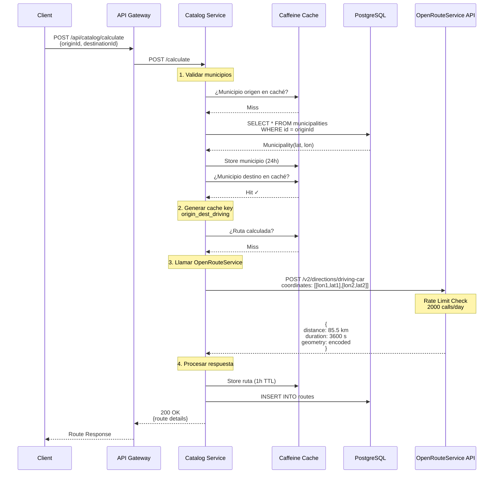
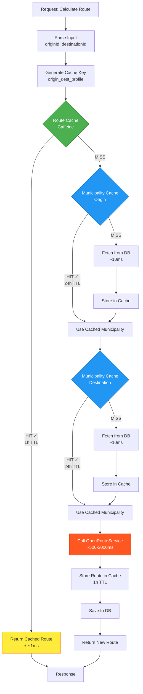
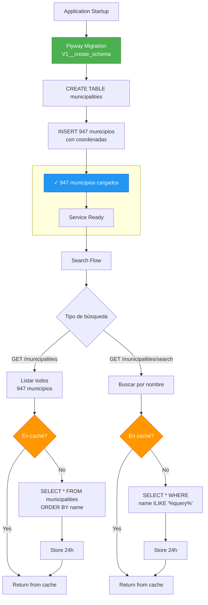
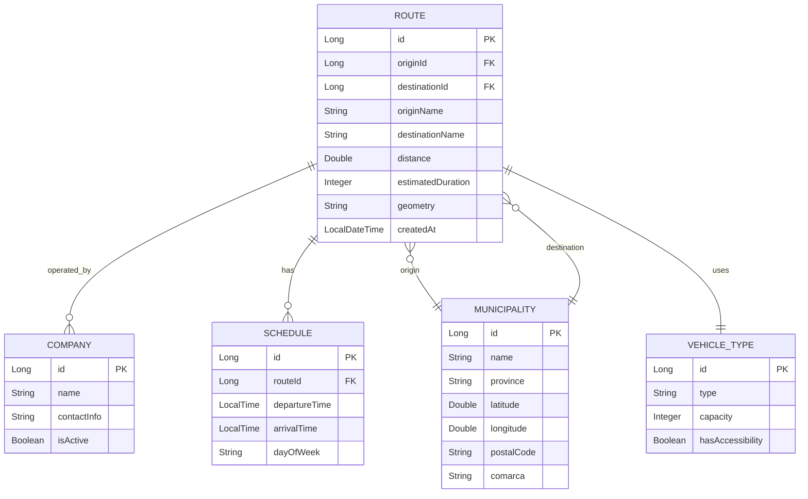
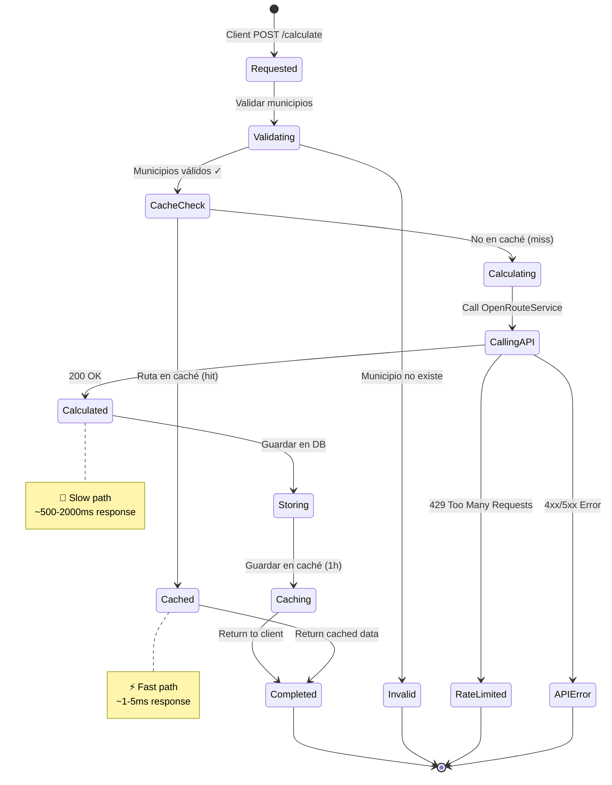
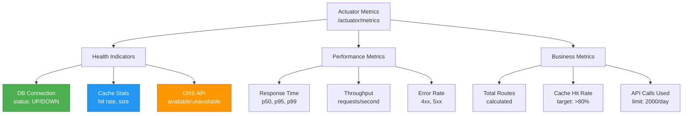

# Catalog Service - Arquitectura

## 🚌 Flujo de Cálculo de Rutas

Proceso completo desde la petición hasta la respuesta con ruta optimizada:



---

## 🗄️ Sistema de Caché Multinivel

Estrategia de caché con Caffeine para optimizar rendimiento:



### Configuración de Caché

| Caché | Max Entries | TTL | Hit Rate Esperado | Tiempo Respuesta |
|-------|-------------|-----|-------------------|------------------|
| **Routes** | 1000 | 1 hora | ~70-80% | ~1ms (cached) |
| **Municipalities** | 1000 | 24 horas | ~95%+ | ~1ms (cached) |
| **DB Query** | - | - | - | ~10-50ms |
| **OpenRouteService** | - | - | - | ~500-2000ms |

### Estrategia de Keys

```
Route Cache Key Format:
{originId}_{destinationId}_{profile}

Ejemplos:
"08001_08015_driving"    → Barcelona a Badalona (coche)
"08001_08015_cycling"    → Barcelona a Badalona (bici)
"08089_08245_driving"    → Manresa a Vic (coche)
```

---

## 🌐 Integración con OpenRouteService

Flujo de comunicación con la API externa:

```mermaid
flowchart TB
    Start[Catalog Service] --> RateCheck{Rate Limit Check<br/>2000/day}
    
    RateCheck -->|Límite alcanzado| RateLimitError[429 Too Many Requests<br/>Retry-After: 86400s]
    RateCheck -->|OK ✓| PrepareRequest[Preparar Request]
    
    PrepareRequest --> BuildBody[Build Request Body:<br/>coordinates: [[lon1,lat1], [lon2,lat2]]<br/>profile: driving-car<br/>format: geojson<br/>units: m]
    
    BuildBody --> AddHeaders[Add Headers:<br/>Authorization: Bearer API_KEY<br/>Content-Type: application/json<br/>Accept: application/json]
    
    AddHeaders --> SendRequest[POST<br/>https://api.openrouteservice.org<br/>/v2/directions/driving-car]
    
    SendRequest --> ORSProcess[OpenRouteService<br/>Processing]
    
    ORSProcess --> CheckResponse{Response Status}
    
    CheckResponse -->|200 OK| ParseSuccess[Parse Response:<br/>- distance (meters)<br/>- duration (seconds)<br/>- geometry (GeoJSON)<br/>- bbox (bounding box)]
    
    CheckResponse -->|400 Bad Request| ValidationError[Invalid Coordinates<br/>o parámetros]
    
    CheckResponse -->|401 Unauthorized| AuthError[API Key inválida]
    
    CheckResponse -->|404 Not Found| RouteNotFound[No route found<br/>entre puntos]
    
    CheckResponse -->|503 Service Unavailable| ServiceDown[ORS temporalmente<br/>no disponible]
    
    ParseSuccess --> Transform[Transform to Domain Model:<br/>Route entity]
    
    Transform --> CacheStore[Store in Cache<br/>1h TTL]
    CacheStore --> DBStore[Persist to DB]
    DBStore --> Success[Return Route]
    
    ValidationError --> ErrorResponse[Error Response]
    AuthError --> ErrorResponse
    RouteNotFound --> ErrorResponse
    ServiceDown --> ErrorResponse
    RateLimitError --> ErrorResponse
    
    ErrorResponse --> End[Client receives error]
    Success --> End2[Client receives route]
    
    style RateCheck fill:#FF9800,stroke:#E65100,color:#fff
    style RateLimitError fill:#f44336,stroke:#c62828,color:#fff
    style ORSProcess fill:#2196F3,stroke:#1565C0,color:#fff
    style ParseSuccess fill:#4CAF50,stroke:#2E7D32,color:#fff
    style CacheStore fill:#9C27B0,stroke:#6A1B9A,color:#fff
```

### Rate Limiting

```
Daily Limit: 2000 calls
Reset: Cada día a las 00:00 UTC

Estrategia:
┌─────────────────────────────────┐
│ Cache Hit (1h) → No consume API │
│ Cache Miss → Consume 1 call     │
└─────────────────────────────────┘

Con 70% hit rate:
- 10,000 requests/day
- 3,000 API calls needed
- ❌ Excede límite

Con caché necesitamos:
- Hit rate > 80% para <2000 calls/day
```

---

## 🗺️ Gestión de Municipios

Arquitectura de datos para 947 municipios de Catalunya:



### Estructura de Datos

```
Municipality Entity:
├── id: Long (Primary Key)
├── name: String (e.g., "Barcelona")
├── province: String (e.g., "Barcelona")
├── latitude: Double (41.3851)
├── longitude: Double (2.1734)
├── postalCode: String (e.g., "08001")
└── comarca: String (e.g., "Barcelonès")

Indices:
├── PRIMARY KEY (id)
├── INDEX idx_name (name)
└── INDEX idx_coordinates (latitude, longitude)

Total registros: 947 municipios
Storage: ~150 KB en DB
Cache memory: ~500 KB (todos en memoria)
```

---

## 📊 Modelo de Datos Completo

Entidades y relaciones del servicio:



### Queries Principales

```sql
-- 1. Buscar ruta entre municipios
SELECT r.* FROM routes r
WHERE r.origin_id = ? AND r.destination_id = ?
ORDER BY r.created_at DESC LIMIT 1;

-- 2. Buscar municipio por nombre
SELECT * FROM municipalities
WHERE name ILIKE '%?%'
ORDER BY name;

-- 3. Rutas más frecuentes (analytics)
SELECT origin_name, destination_name, COUNT(*) as total
FROM routes
GROUP BY origin_name, destination_name
ORDER BY total DESC
LIMIT 10;

-- 4. Municipios sin rutas
SELECT m.* FROM municipalities m
LEFT JOIN routes r ON m.id = r.origin_id OR m.id = r.destination_id
WHERE r.id IS NULL;
```

---

## 🔄 Ciclo de Vida de una Ruta

Estados y procesamiento de una ruta calculada:



---

## 🏗️ Arquitectura Reactiva

Stack técnico con Spring WebFlux:

```mermaid
flowchart LR
    Client[Client Request] --> Controller[RouteController<br/>@RestController]
    
    Controller --> Service[RouteService<br/>@Service]
    
    Service --> Cache[CacheManager<br/>Caffeine]
    Service --> Repo[RouteRepository<br/>R2DBC]
    Service --> ORS[OpenRouteService<br/>WebClient]
    
    Cache -.->|Mono/Flux| Service
    Repo -.->|Mono/Flux| Service
    ORS -.->|Mono| Service
    
    Service -.->|Mono| Controller
    Controller -.->|JSON| Client
    
    Repo --> R2DBC[R2DBC Pool<br/>PostgreSQL]
    R2DBC --> DB[(PostgreSQL<br/>catalog schema)]
    
    style Controller fill:#4CAF50,stroke:#2E7D32,color:#fff
    style Service fill:#2196F3,stroke:#1565C0,color:#fff
    style Cache fill:#FF9800,stroke:#E65100,color:#fff
    style ORS fill:#9C27B0,stroke:#6A1B9A,color:#fff
    style DB fill:#00BCD4,stroke:#006064,color:#fff
```

**Ventajas del Stack Reactivo:**
- Non-blocking I/O
- Mejor uso de threads (event loop)
- Backpressure automático
- Composición con operadores Mono/Flux
- Escalabilidad sin aumentar threads

---

## 🎯 Métricas y Monitoreo

KPIs del servicio:



### Alertas Recomendadas

| Métrica | Umbral | Acción |
|---------|--------|--------|
| Cache Hit Rate | < 70% | Revisar TTL, aumentar size |
| API Calls Remaining | < 200/day | Activar rate limiting |
| Response Time p95 | > 3s | Revisar ORS, DB queries |
| Error Rate | > 5% | Check logs, ORS status |
| DB Connection Pool | > 80% used | Aumentar pool size |

---

## 🔗 Referencias

- [README Principal](./README.md)
- [Configuración](./src/main/resources/application.yml)
- [OpenRouteService API Docs](https://openrouteservice.org/dev/#/api-docs)
- [Flyway Migrations](./src/main/resources/db/migration/)
- [Route Controller](./src/main/java/com/busconnect/catalogservice/controller/RouteController.java)
