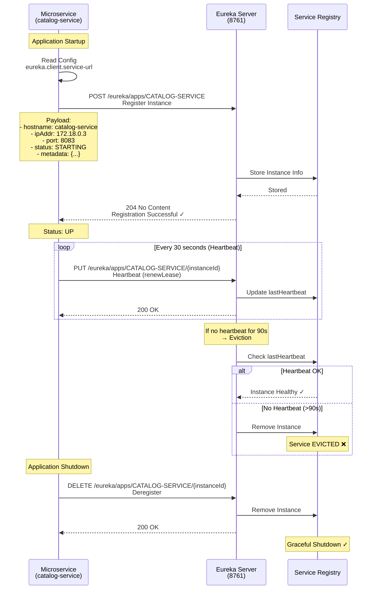
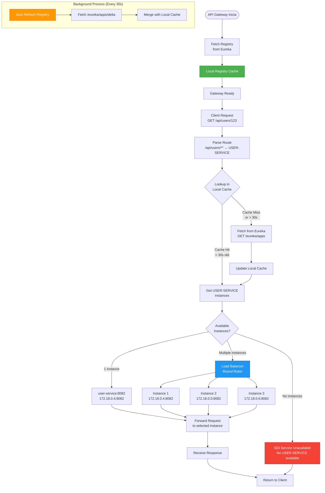

# Eureka Service - Arquitectura

## 📝 Service Registration Flow



---

## 🔍 Service Discovery Flow



---

## 💓 Health Check & Self-Preservation

```mermaid
stateDiagram-v2
    [*] --> Normal: Eureka Server Start
    
    Normal --> Monitoring: Monitor Heartbeats
    
    Monitoring --> CalculateRenewals: Calculate Renewal Rate<br/>Every 15 minutes
    
    CalculateRenewals --> CheckThreshold{Renewal Rate<br/>> 85%?}
    
    CheckThreshold -->|Yes ✓<br/>Healthy| Normal: Continue Normal Operation
    
    CheckThreshold -->|No ❌<br/>< 85%| SelfPreservation: ENTER SELF-PRESERVATION MODE
    
    Normal: 🟢 NORMAL MODE
    Normal: - Evict unhealthy instances
    Normal: - Remove after 90s no heartbeat
    Normal: - Registry up-to-date
    
    SelfPreservation: 🟡 SELF-PRESERVATION MODE
    SelfPreservation: - DO NOT evict instances
    SelfPreservation: - Keep all registered services
    SelfPreservation: - Assume network partition
    
    SelfPreservation --> WaitRecovery: Wait for Recovery
    
    WaitRecovery --> RecheckThreshold{Renewal Rate<br/>> 85%?}
    
    RecheckThreshold -->|No| SelfPreservation: Stay in Self-Preservation
    RecheckThreshold -->|Yes ✓| ExitSelfPreservation: EXIT SELF-PRESERVATION
    
    ExitSelfPreservation --> CleanupExpired[Cleanup Expired Instances]
    CleanupExpired --> Normal
    
    note right of SelfPreservation
        Warning en Dashboard:
        "EMERGENCY! EUREKA MAY BE 
        INCORRECTLY CLAIMING 
        INSTANCES ARE UP WHEN 
        IN FACT THEY ARE NOT."
    end note
    
    note right of CheckThreshold
        Threshold Calculation:
        Expected Renewals = 
        (Total Instances × 2) / minute
        
        Actual Renewals = 
        Count in last minute
        
        Rate = Actual / Expected
    end note
```

---

## 🔗 Referencias

- [README Principal](./README.md)
- [Configuración](./src/main/resources/application.yml)
- [Eureka Dashboard](http://localhost:8761)

