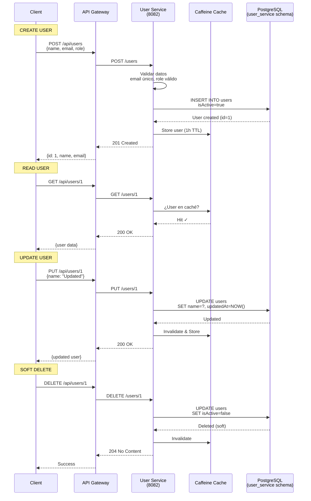
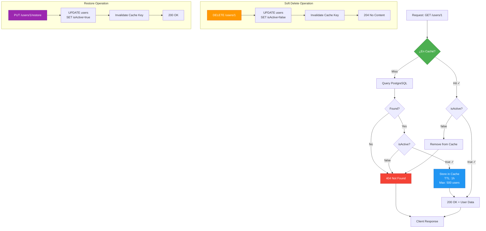
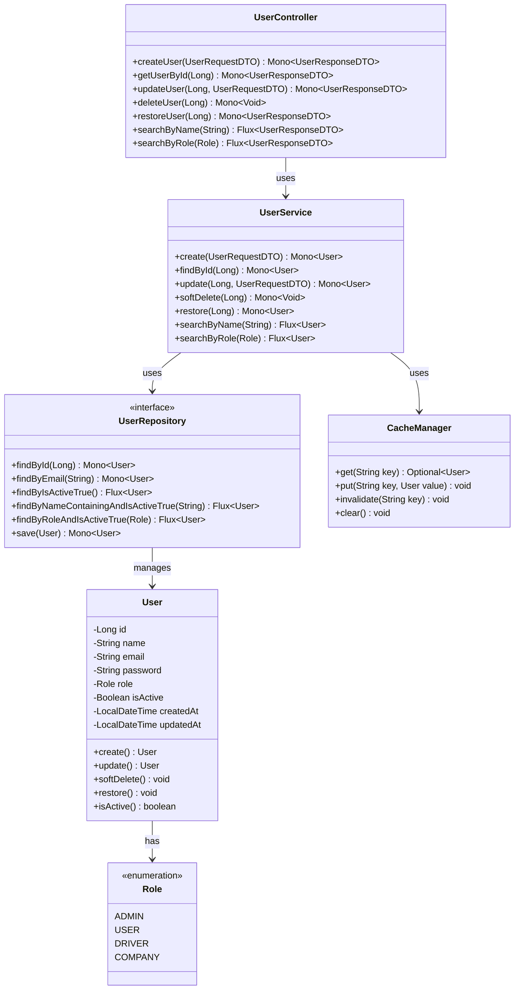
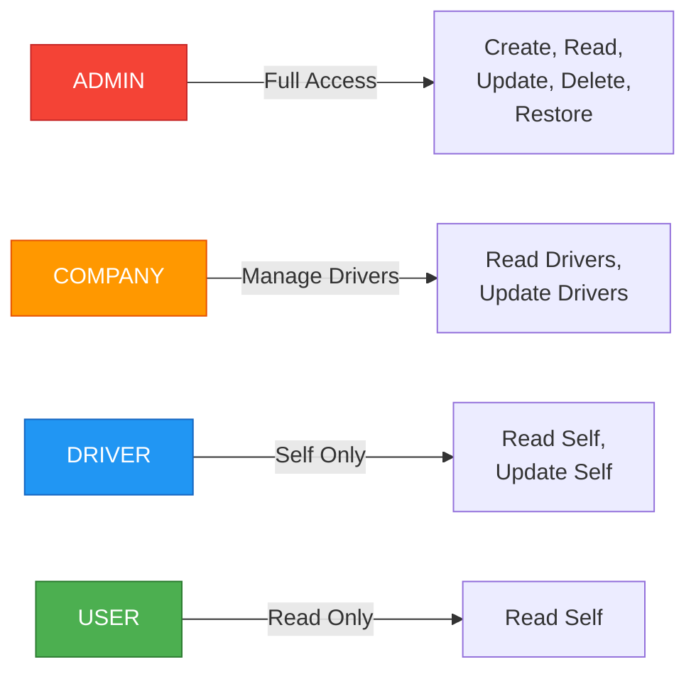

# User Service - Arquitectura

## 👤 CRUD Operations Flow



---

## 🗃️ Soft Delete & Cache Strategy



### Cache Configuration

| Parámetro | Valor | Descripción |
|-----------|-------|-------------|
| Max Entries | 500 users | Límite de usuarios en caché |
| TTL | 1 hora | Tiempo de vida |
| Eviction Policy | LRU | Least Recently Used |
| Hit Rate Target | >80% | Objetivo de eficiencia |

---

## 📊 Domain Model



### Database Schema

```sql
CREATE TABLE users (
    id BIGSERIAL PRIMARY KEY,
    name VARCHAR(100) NOT NULL,
    email VARCHAR(255) UNIQUE NOT NULL,
    password VARCHAR(255) NOT NULL,
    role VARCHAR(20) NOT NULL,
    is_active BOOLEAN DEFAULT true,
    created_at TIMESTAMP DEFAULT CURRENT_TIMESTAMP,
    updated_at TIMESTAMP DEFAULT CURRENT_TIMESTAMP
);

CREATE INDEX idx_users_email ON users(email);
CREATE INDEX idx_users_role ON users(role);
CREATE INDEX idx_users_active ON users(is_active);
CREATE INDEX idx_users_name ON users(name);
```

---

## 🎯 Endpoints Summary

| Método | Endpoint | Descripción | Cache |
|--------|----------|-------------|-------|
| POST | `/users` | Crear usuario | Store on create |
| GET | `/users/{id}` | Obtener por ID | Read-through |
| PUT | `/users/{id}` | Actualizar usuario | Write-through |
| DELETE | `/users/{id}` | Soft delete | Invalidate |
| PUT | `/users/{id}/restore` | Restaurar usuario | Invalidate |
| GET | `/users/search/name?q={name}` | Buscar por nombre | No cache |
| GET | `/users/search/role?role={role}` | Buscar por rol | No cache |

---

## 🔐 Role-Based Access Control



---

## 🔗 Referencias

- [README Principal](./README.md)
- [Configuración](./src/main/resources/application.yml)
- [User Model](./src/main/java/com/busconnect/userservice/model/User.java)
